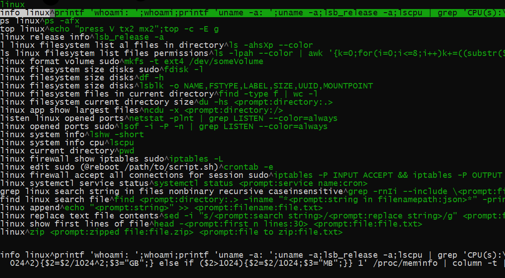

# Terminal command bookmark manager

Save your terminal commands in one place. 
Then find command through searchable dropdown.
Uses ncurses. 
Doesn't work on alpine.



## Build environment
Preparing:
```console
sudo apt install build-essential
```
building:
```console
./build.sh
```
## Creating bookmarks
* Bookmarks are simply terminal commands.
* Add them in cli.cpp file
* Add `^` symbol at the start of command to describe it
```console
linux list directories^ls
```
* Bookmarks support user input with default values. Bookmark such as `du -hs <prompt:enter directory:.>` will ask for input string which will replace "prompt" tag. If user enters no characters default value (in parentheses) will be used.

Example:
```console
$ ./cli
prepare comm: du -hs <prompt:directory:.>
directory (.): /tmp
executing: du -hs /tmp

54M     /tmp
```

## Using program

### Standard way:
```console
./cli
```

### Shortcut way
```console
./cli ls
```
will execute first bookmark it finds with passed argument as a console command `ls linux filesystem list files permissions^ls -lpah --color | awk '{k=0;for(i=0;i<=8;i++)k+=((substr($1,i+2,1)~/[rwx]/)*2`: 
```console
ls -lpah --color | awk '{k=0;for(i=0;i<=8;i++)k+=((substr($1,i+2,1)~/[rwx]/)*2
```


## Make it accessible from any directory
```console
ln -s /currentdir/cli /usr/bin/yournewcli
```